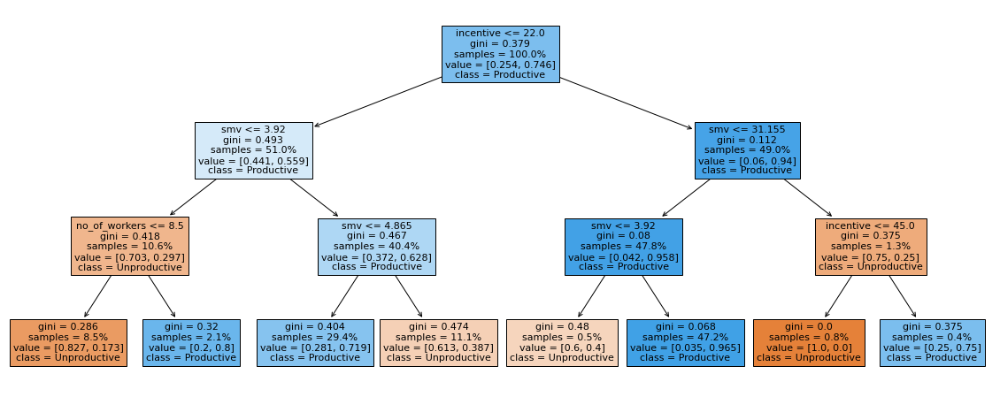

# Predicting Employee Productivity Using Tree Models
  Build a classification tree to evaluate features which can predict employee productivity

The project aims to predict the productivity of garment employees using the dataset from the UCI Machine Learning Repository. It highlights the importance of tracking, analyzing, and predicting productivity in the garment industry.
The dataset includes various features such as date, quarter, department, day, team, targeted productivity, and actual productivity, among others.
Initial observations note issues like actual productivity values surpassing the limit of 1, a specific number for work in progress, and efficient time management with minimal idle time and idle men.

The project's main objective is to use tree-based models for either regression or classification to predict employee productivity.
It starts with data cleaning and analysis, preparing the dataset for model building.

The project's main objective is to use tree-based models for either regression or classification to predict employee productivity.

Conclusion:
The "incentive" and the "smv" variables were the ones with the greatest influence on the final prediction. i.e "incentive" variable represents the amount of financial incentive offered to motivate a particular course of action. The "smv" (Standard Minute Value) variable represents the time allocated for a specific task. For a detailed list of all the variables, please see the project.ipynb file 

